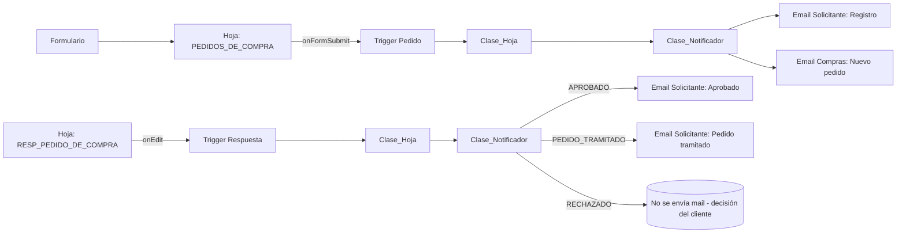

# Automatización de Pedidos de Compra

## 📌 Contexto
Proyecto en **Google Apps Script** para automatizar el flujo de pedidos de compra en una empresa.  
El sistema cubre tres etapas:
1) **Registro del pedido** (El area solicitante realiza un pedido).  
2) **Aprobación** (Area de "Compras", valida o rechaza).  
3) **Pedido Tramitado** (Area de "Compras", realiza la compra).

En cada etapa se envían notificaciones automáticas al **solicitante** y/o al **Área de Compras**.

---

## ⚙️ Componentes principales

### `Mails_de_Areas`
- **Rol:** base de datos mínima de referencia.
- **Función:** vincula **Área → Email**.
- **Extras:** normalización de texto (mayúsculas/tildes) para robustez.
- **Uso:** resuelve destinatarios sin hardcodear correos.

### `Biblioteca/Clase_Hoja`
- **Rol:** clase base para manejar eventos de hoja.
- **Función:** ubica la fila del evento y extrae parámetros clave:
  - `N° RI`, `Área`, `Descripción`.
- **Subclases:** cada hoja redefine el **constructor** según sus encabezados (no obliga a nombres idénticos).

### `Biblioteca/Clase_Notificador`
- **Rol:** lógica general de notificación.
- **Función:** recibe el evento, obtiene parámetros (vía `Clase_Hoja`)(tiene la capacidad de añadir mas parametros de ser necesario), arma el mensaje y dispara el envío.
- **Salida:** datos del mail + `MailApp.sendEmail`.

### `Pedidos` (hojas y notificadores)
- **Solicitud de Compra (HojaPedidos + NotificadorPedidoCompra):**
  - Hija de `Clase_Hoja` y usa `Clase_Notificador`.
  - Envía confirmación al **solicitante** y notificación al **Área de Compras**.
  - Trigger personalizado que **filtra** eventos para no disparar cuando no corresponde.
- **Respuestas de Compras (NotificadorAprobado):**
  - Detecta cambios de **ESTADO** en la hoja de respuestas.
  - Estados: `APROBADO`, `PEDIDO_TRAMITADO`.
  - Notifica al solicitante en cada transición relevante.

---

## 🔄 Flujo del sistema

1. **Solicitud (onFormSubmit):**
   - Formulario → nueva fila en `PEDIDOS DE COMPRA`.
   - Se envían 2 correos:
     - A **solicitante**: “Tu pedido fue registrado”.
     - A **Compras**: “Mail identico al del solicitante”.

2. **Aprobación (onEdit en hoja de respuestas):**
   - Compras marca `APROBADO`.
   - Se notifica al solicitante el estado y observaciones.

3. **Pedido Realizado (onEdit en hoja de respuestas):**
   - Compras marca `PEDIDO_TRAMITADO`.
   - Se envía confirmación al solicitante: “Tu pedido ya fue Tramitado”.

---

## 🧩 Decisiones de diseño
- **POO** con separación clara:
  - `Clase_Hoja` (datos) / `Clase_Notificador` (emails) / **Triggers** (eventos).
- **Subclases de Hoja** para tolerar encabezados distintos por archivo.
- **Tabla única** de mails (`Mails_de_Areas`) como **fuente de verdad**.
- **Triggers con filtrado** de contexto para evitar ejecuciones indebidas.

---

## ✉️ Plantillas de email (sugeridas)
- **Registro**: `Solicitud de compra registrada – RI {{ri}}`
- **Aprobación**: `Tu pedido {{ri}} fue APROBADO`
- **Pedido tramitado**: `Tu pedido {{ri}} ya fue tramitado`

> Nota: en caso de **RECHAZO** no se envía correo (definición del cliente).

---

## 🛠️ Trabajos futuros

### Clase `Trigger` (diseño previsto)
- **Objetivo:** centralizar `onFormSubmit` y `onEdit` en una única clase.
- **Responsabilidades:**
  - Recibir evento de Google.
  - Instanciar la hoja adecuada (p.ej. `HojaPedidos`).
  - Invocar al notificador correspondiente.
  - Manejar errores y logs de auditoría.
- **Ventaja:** desacopla la lógica de negocio de los triggers y facilita escalar.

- **Configuración flexible de columnas**  
  - Permitir elegir entre búsqueda por **nombre de columna** o por **posición de columna** (a criterio del cliente).  
  - Beneficio: mayor adaptabilidad a distintos layouts de planillas.

- **Logs y auditoría**  
  - Registrar en una hoja separada cada envío de mail (fecha, destinatario, estado del pedido).  
  - Beneficio: trazabilidad completa y control de errores.

- **Panel de métricas**  
  - Crear una hoja o dashboard que muestre: pedidos por área, tiempos de aprobación, cantidad de pedidos cursados.  
  - Beneficio: información de gestión para la empresa.

---
